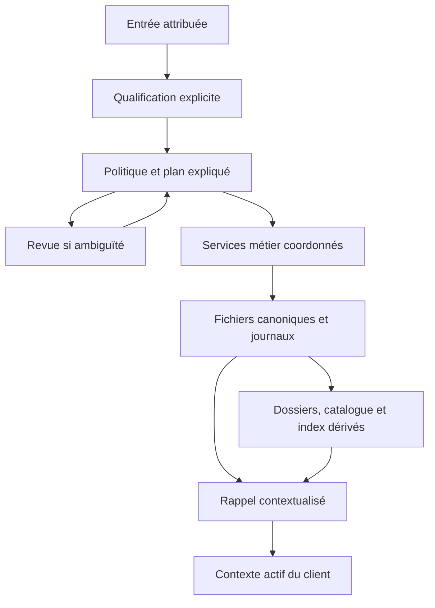

# Architecture cible du Memory Engine

Référence consolidée le 01/10, état de livraison actualisé le 02/10/2026 sur
`43a1214`. Voir [le bilan actuel](AUDIT-2026-10-02.md) ; les sections datées
plus bas conservent la progression historique.
Ce document décrit **la cible**, avec son état d'implémentation explicite.
[ARCHITECTURE.md](ARCHITECTURE.md) décrit les chemins actuels ;
[l'audit](AUDIT-2026-10-01.md) et [la TODO](../TODO-LIST.md) portent les preuves
et l'ordre de livraison. Les mécanismes proposés restent à implémenter/tester.
Les décisions D1–D9 déjà validées ne sont pas rouvertes.

## Finalité et frontières

Le moteur doit permettre à un client de se souvenir utilement : reprendre un
projet, retrouver une décision et ses raisons, différencier une observation
passée d'un état présent, et proposer le bon contexte sans confondre pertinence
et vérité. Il reste indépendant du modèle, de l'agent et du stockage d'index.

La perception et le pilotage du robot, le dialogue et les actions externes
appartiennent aux clients. Le moteur reçoit des observations/propositions
attribuées, gère leur devenir et restitue leurs sources. Aucun travail sur
Eidolon Core, Hermes ou Qdrant n'est requis pour construire et tester cette
architecture ; commencer par un client factice local.

## Dimensions à conserver séparément

| Dimension | Sens et règle |
| --- | --- |
| Type | Fait, observation, hypothèse, décision, préférence, question… ; ne pas traiter tout message comme un fait |
| Origine | Auteur, source immédiate, capteur/modèle, mode de production et chaîne de dérivation ; inconnu reste inconnu |
| Autorité | Droit de proposer/valider une action dans un contexte ; le rôle admin ne rend pas une affirmation vraie |
| Nature | Technique, réflexion, structure spatiale, présence mobile, obstacle, compte rendu d'action, intention de projet… |
| Statut épistémique | CONFIRMED, REFUTED, CONFLICTED, etc. ; distinct de la confiance et du statut d'un projet |
| Contexte | Sujet, projet/lieu, conditions et portée explicites ; contexte absent ≠ universel |
| Temps | Date d'observation, enregistrement, validité, réexamen et éventuelle reprise ; ne pas les substituer l'une à l'autre |
| Disponibilité | Haute, intermédiaire ou basse selon la tâche et l'utilité attendue |
| Rétention | Conservation, revue, archive ou suppression autorisée ; aucune équivalence avec un niveau de disponibilité |
| Preuves/relations | Informations soutenant ou contredisant une proposition et liens vers les objets concernés |

Deux Informations peuvent rester confirmées dans des contextes différents.
Dans un même contexte, un désaccord non résolu doit rester visible. La cible
ne choisit pas un gagnant à partir du seul rôle, de la récence ou du score lexical.
Le planner actuel accepte un conflit déclaré ; il ne le découvre pas lui-même.

## Objets, propriété et histoire

**Information** représente une unité de connaissance contextualisée. `Memory`
est le conteneur complet du backend, y compris contenu structuré et extensions.
Le mapping Information ↔ Memory couvre les textes explicitement étiquetés ;
il ne doit jamais amputer un snapshot complet ni servir d'import implicite.

**Thread** porte un projet, ses objectifs, actions, statut et liens CONCERNS.
Une nouvelle Information d'un projet existant doit pouvoir lui être rattachée
sans recréer le Thread. Actions et liens nécessitent des commandes coordonnées
avec révision attendue. Les lieux et thèmes pourront avoir des dossiers dédiés
sans hériter artificiellement de tous les statuts d'un projet.

**Operation** assure la reprise d'une commande. **Event** décrit une transition
métier attribuée ; il n'est ni une Instruction exécutable ni une copie complète
de la mémoire. **Reçu compact** conserve l'identité et le résultat de rejeu
après retrait des snapshots. La suppression conserve sa famille de reçus tant
que l'alignement D5 n'est pas implémenté. Une Review core opérationnelle reste
à définir ; les Reviews historiques sont archivées sans faux Events rétroactifs.

**Histoire sémantique et versions techniques sont distinctes.** Pour garder
« fourchette observée au sol à 10 h » après son retrait à 10 h 15, conserver
des observations distinctes et les relier à l'état courant. En v1, modifier
une Information puis compacter ses opérations ne permet pas de relire tous
ses anciens textes. Une archive de révisions serait un autre contrat (T-050).

## Chaîne de traitement visée

| Couche | Responsabilité cible | Présent / restant |
| --- | --- | --- |
| Entrée | Identité de source, dates, provenance, contenu et éventuelles qualifications | Memory accepte ces données ; adaptateurs et contrat d'entrée métier à raccorder |
| Qualification | Séparer les éléments d'un message et attribuer type/nature/contexte avec origine de la proposition | Annotations explicites uniquement ; extraction automatique optionnelle, non livrée |
| Politique | Décider séparément stockage, dossier, disponibilité, applicabilité et réexamen | Plan pur et exécution STORE/UPDATE livrés ; qualification explicite et branches partielles |
| Application | Exécuter les commandes autorisées, refuser les plans périmés, produire des résultats rejouables | Services Information/Thread et RoutingExecutor vers projet existant ; nouveau projet et autres branches restent ouverts |
| Canonique | Persister les objets et les états opérationnels ; isoler les formats historiques | Existant, reprise globale/readiness livrées ; écrivains historiques et service réel à raccorder |
| Dérivés | Construire des vues vérifiables, signaler le retard et permettre la reconstruction | Dossiers, rapprochement et catalogue persistants livrés ; scans complets, aucune récurrence installée |
| Disponibilité | Activer/désactiver, préparer les reprises futures et réexamens | Niveaux persistants, échéances durables et passe d’entretien explicite livrés ; ordonnanceur et politiques de session ouverts |
| Restitution | Sélection par contexte, statuts, temps, source et budget ; expliquer les inconnues | Rappel contextualisé raccordé à la façade ; qualité sur corpus réel et clients à valider |

RoutingExecutor fournit la première façade Python : preview sans écriture,
exécution à révisions attendues, résultat/rejeu et rappel contextualisé. Les CLI
readiness/recover-all et MaintenancePass complètent état, reprise et entretien.
Les autres branches métier restent à assembler ; un serveur HTTP n’est pas une
dépendance du noyau.

## Écritures, conflits et reprise

Toute mutation métier passe par le coordinateur de sa famille. Les primitives
publiques de backend restent utilisables pour import/stockage explicite, selon
D3, mais ne sont pas le parcours métier par défaut. Un assemblage canonique
doit injecter toutes les familles nécessaires, plutôt que laisser chaque client
choisir ses journaux et oublier un contrôle de conflit.

Contrat acquis Information : nouvelle révision 1, import distinct, commande
complète normalisée et horodatage figé, révision attendue, Operation avant
mutation, Event déterministe, COMMITTED après publication. Le même identifiant
de commande avec un autre contenu est un conflit. Le rejeu terminal rend le
résultat antérieur même après suppression, sans restaurer l'objet.

La compaction publie le reçu durable, le relit, vérifie la concordance, puis
retire durablement le plan. Une coexistence divergente bloque. À PENDING_DELETE,
annuler avant de modifier (D7) ; compacter avant APPLYING_DELETE ; CANCELLED
réserve encore l'identité (D9). Les empreintes sont conservées sans garantie
de confidentialité des contenus courts (D8).

Ordres actuels : Information Persistent → Operation → Event ; création liée
Persistent → Thread → Operation → Event ; statut Thread Thread → Operation →
Event ; dossier Persistent → Thread → Dossier. Les futures mutations de liens
doivent respecter ces contraintes ; aucun chemin ne doit prendre Persistent
après avoir pris Thread. Tester les interruptions et la concurrence inter-familles.

Un plan « stocker puis rattacher puis reconstruire » peut s'interrompre entre
ces étapes : il exige des étapes rejouables et un état de progression explicite.
Pas de promesse de transaction globale. Une projection peut échouer après une
écriture canonique réussie ; le résultat doit exposer ce retard et sa reprise,
sans rejouer aveuglément la création.

Après démarrage, une barrière d'exploitation doit inventorier toutes les
familles, reprendre ce qui est récupérable puis refuser les nouvelles écritures
tant que subsiste un état bloquant. T-048 livre ce contrôle explicite en local :
`readiness` en lecture seule et `recover-all` avec relecture finale, reprise des
suppressions Information approuvées et répétition bornée en cas de progrès.
Les états inconnus/corrompus/FAILED arrêtent la reprise automatique.
Ce contrôle ponctuel ne remplace pas l'arrêt des écrivains ni les essais des
dépendances réelles avant d'installer un démarrage automatique sur la VM.

## Dossiers Markdown et catalogue

Chaque projet possède un dossier lisible : objectif, récapitulatif sourcé,
décisions avec conditions, Informations liées, questions, actions et échéances.
L'association vient d'un lien explicite ou d'une décision de revue ; un mot-clé
commun ne justifie pas une fusion. La cible crée le dossier à la création du
projet et l'actualise après les changements pertinents.

La zone générée référence IDs/révisions et une empreinte de dépendances.
Les notes humaines sont préservées mais **ne sont pas dérivées** : leur fichier
doit être sauvegardé. Elles ne deviennent canoniques qu'après une commande
d'ingestion explicite. Une zone générée périmée est signalée, reconstruite ou
écartée de la restitution automatique. Son absence ne doit pas rendre le
contenu canonique introuvable.

Le catalogue léger expose IDs, types, statuts, mots-clés, portée, échéances,
révisions et pointeurs. Il rend aussi les mémoires basses retrouvables sans
charger tous leurs textes en contexte. Il reste reconstructible ; les mots-clés
et qualifications qui ne peuvent pas être recalculés appartiennent aux objets
canoniques. Le catalogue n'est pas à lui seul une politique de disponibilité.

Orientation issue de la revue Claude : rapprochement par manifeste comme
mécanisme de réparation des dérivés. T-044 le livre maintenant à la demande pour
les dossiers projet (`reconcile --apply`), avec reprise par relance et traitement
des vues orphelines. T-045 livre le catalogue reconstructible de métadonnées,
avec contrôle de fraîcheur et recherche filtrée. La programmation régulière
et l'accélération des lectures restent à livrer.
Garder les IDs/révisions et hashes (les accès directs peuvent modifier les
fichiers sans révision). Le suivi durable reste requis pour les intentions et
échéances ; il n'est pas une dépendance obligatoire de chaque projection. Une simple notification volatile
après COMMITTED ne suffit pas : une panne à cet instant perdrait la mise à jour.
Pour le premier parcours, reconstruction explicite idempotente et contrôle des
dépendances ; avant automatisation, reprise testée du retard et des suppressions.
Éviter une nouvelle source de vérité cachée dans un cache.

## Haute, intermédiaire, basse

| Niveau | Usage | Mécanisme cible |
| --- | --- | --- |
| Haute | Discussion ou tâche en cours, perception utile maintenant | Sélection bornée de références/extraits, liée à une session/tâche et réévaluée lors du rappel |
| Intermédiaire | Projet actif, élément à reprendre bientôt ou à date fixée | Fiches légères, mots-clés, actions et déclencheurs durables pointant vers le canonique |
| Basse | Connaissance durable sans accès rapide nécessaire | Contenu canonique conservé, retrouvable via catalogue/recherche, activable à la demande |

Ce sont des modes de disponibilité, pas trois copies systématiques ni les
répertoires legacy working/persistent/history. Une disposition de maison
conservée longtemps peut être activée en haute pendant la navigation.

T-046 livre les états durables SCHEDULED/APPLYING et terminaux, les dates avec
fuseau, référence/révision, annulation et reprise après arrêt. Le format 2 de
routage enregistre disponibilité et échéance ; la passe d’entretien explicite
traite les échéances puis répare les dérivés. L’effet moteur utilise un
identifiant stable et les journaux canoniques. Ne pas promettre « exactly once » pour une action externe.
Le moteur réactive/propose ; le client décide des actions effectives.

Éviction du contexte, expiration d'applicabilité, archivage et suppression sont
quatre opérations distinctes. Pas de TTL universel imposé. Les durées par nature
et les budgets de mémoire active seront des politiques explicites, mesurées.
La fenêtre 04 h–08 h et la reprise après 30 minutes d'inactivité sont des
préférences de maintenance à confirmer dans l'exploitation, pas un job livré.

## Rappel contextualisé et exemples de recette métier

La cible sélectionne des candidats, contrôle leur état/révision, évalue portée
et période, applique le mode demandé puis classe et borne les extraits.
Un mode historique doit pouvoir restituer REFUTED/CONFLICTED avec leurs raisons ;
un mode opérationnel doit rendre visible une incertitude pertinente sans la
transformer en instruction ou en vérité établie. La politique exacte des filtres
est versionnée et testée, pas cachée dans le score lexical.

Chaque résultat doit exposer identité/révision, origine, observation/validité,
statut, contexte d'applicabilité, raisons de sélection et éventuelle troncature.
Les budgets d'extraits n'incluent pas automatiquement le prompt final du client.

| Situation | Comportement cible à démontrer de bout en bout |
| --- | --- |
| Discussion technique avec l'admin | Distinguer hypothèse, décision et mesure ; rattacher au projet sans promotion automatique de vérité |
| Discussion philosophique | Garder opinion/question dans son contexte si utile ou demandé ; pas de fait général fabriqué |
| Deux chambres, bureau, salle de bain et WC | Connaissance spatiale attribuée au lieu ; conservation durable, activation pendant navigation, révision possible |
| Chat aperçu | Observation datée, disponibilité immédiate ; ne pas déclarer sa position toujours actuelle |
| Fourchette contournée | Conserver observation et action séparées ; contournement ≠ retrait ; réexaminer avant navigation ultérieure |
| Projet à reprendre plus tard | Dossier et fiche intermédiaire, échéance durable ; redémarrage sans double effet |
| 200 W pour rendement / 300 W pour débit | Deux recommandations compatibles avec des objectifs distincts ; demander/montrer le contexte manquant |
| Correction ou suppression | Dérivés périmés écartés/actualisés, identités réservées et rejeu sans résurrection |

## Exploitation et implantation

| Emplacement | Statut et fonction |
| --- | --- |
| `memory/persistent/*.md` et `threads/*.md` | Existants : objets canoniques courants |
| `memory/history/operations/{thread-create-v1,thread-status-v1,thread-delete-v1,information-write-v1}` | Existants : journaux coordonnés, contenu sensible possible |
| `memory/history/events/{thread-create-v1,thread-status-v1,information-write-v1}` | Existants : Events par famille ; pas d'Event de suppression produit actuellement |
| `memory/history/operation-receipts/information-write-v1` | Existant : reçus compacts |
| `memory/history/pending-delete` | Existant : reçus de suppression Information |
| `memory/sources` | Sources originales, fiches et extraction figée T-051 ; non supprimées automatiquement, à sauvegarder |
| `memory/dossiers` ou sortie dédiée | Existant : projection projet explicite et notes humaines |
| `memory/catalogue/information-v1.json` | Livré : catalogue reconstructible ; index externe différé |
| Métadonnée availability ; `memory/history/operations/lifecycle-trigger-v1` | Livrés : niveaux et intentions durables ; projections réparées à partir de leur fraîcheur |
| Archive d'import et sauvegardes | Destination séparée ; archivage actuel ne réactive pas les contraintes métier |

Les données réelles et secrets restent hors Git. Sauvegarder le canonique,
les journaux/reçus nécessaires au rejeu, les notes humaines et, lorsqu'ils
existeront, les états durables d'échéance/progression. Les index purs sont
reconstructibles. Si les dossiers sont hors de MEMORY_ENGINE_ROOT, les inclure
explicitement dans la sauvegarde ; la recette d'une racine ne les copie pas.

La migration est explicite, sur source arrêtée et destination distincte,
avec rapport de rejets et vérification des octets **et du sens opérationnel**.
Des journaux archivés ne doivent pas être exécutés comme s'ils étaient actifs.
Le contrôle de démarrage vérifie environnement puis état métier ; la copie VM,
restauration par hash, concurrence, audits et reprise conditionnent la mise en service.

## Décisions restant réellement ouvertes

- Contrat d'import des réservations, révisions et états de projets historiques.
- Conservation de l'histoire sémantique versus anciennes révisions textuelles ;
  rétention des snapshots Thread, notes humaines, dérivés et sauvegardes (T-050).
- Extension de la façade aux nouveaux projets, autres plans et clients ; liens/actions
  Thread et progression du premier parcours sont livrés.
- Passage à des dérivés incrémentaux et clôture de purge ; fraîcheur par manifests
  et réparation explicite dossiers/catalogue déjà livrées.
- Forme des dossiers lieu/thème, critères de revue des qualifications et conflits.
- Délais par nature, budgets de session, récurrence et protocole d’acquittement du
  client externe ; déclencheurs locaux et acquittements canoniques déjà livrés.

Les choix techniques courants dans les décisions déjà approuvées ne demandent
pas de nouvelle permission. Un choix métier nouveau est présenté avec ses
conséquences avant implémentation. La revue Claude E-005 à E-007 est reçue avec
un patch testé en isolation mais non intégré. Voir [la contre-revue](REVUE-CLAUDE-2026-10-01.md).
Elle confirme les blocages ; certaines propositions demandent les réserves
ci-dessous et ne constituent pas une validation VM.

## Précisions après revue Claude du 01/10

- Le contrôle de démarrage différencie PENDING_DELETE valide et reprise
  non terminée, inclut APPLYING_DELETE et ne suppose pas qu'un ordre fixe
  résout toutes les dépendances. La résolution humaine d'un FAILED doit
  qualifier ses effets déjà écrits, ses réservations et le comportement de rejeu.
- La commande d'exécution distingue identifiant stable d'intention et hash
  du plan figé. Même contenu ne signifie pas nécessairement même demande.
- La purge des dérivés doit avoir une clôture reprenable pour les vues gérées
  par le moteur. Le DELETED canonique actuel ne l'atteste pas ; notes humaines,
  sauvegardes et copies clientes exigent leurs propres règles explicites.
- Une archive de révisions complète est optionnelle, sans activation implicite
  par LONG_TERM/PERMANENT. Sa publication et sa suppression doivent être reprises
  après interruption si cette politique est retenue.
- L'entretien récurrent doit être reportable si le système est occupé et
  reprendre par lots. Profil quotidien léger/hebdomadaire approfondi proposé,
  fréquence et critères de charge à décider ; horaire exact à consolider avec
  le souhait 3–4 h. Aucun ordonnanceur n'est livré et aucune revue nocturne
  ne transforme seule une contradiction en réfutation.

## Avancée du lot du 01/10 au soir

Les commandes de mutation des liens/actions et titre/objectif/contexte Thread
sont désormais livrées avec journal THREAD_UPDATE, Event UPDATED, révision et
reprise. ThreadService.for_backend assemble les coordinateurs canoniques.
La migration mixte est refusée avant toute écriture de destination ; l’import
opérationnel reste à définir. Ces livraisons lèvent deux prérequis de la chaîne
métier ; la façade d’exécution des plans et l’actualisation automatique des
dossiers restent ouvertes. Voir la TODO et THREAD-UPDATES.md.

## Parcours local exécuté et rappel — suite du 01/10

La tranche qualifiée STORE/UPDATE → projet existant → dossier est maintenant
journalisée par RoutingExecutor et reprise par recover-all. Son rappel applique
applicabilité/statuts avant budgets, expose provenance/preuves et incertitudes,
et lit le canonique en signalant les dossiers périmés. Les intentions en cours
réservent leurs cibles jusqu’au reçu compact final. Contrats : ROUTING-EXECUTION.md
et CONTEXTUAL-RECALL.md. Catalogue, nouvelles branches métier, maintenance et
activation/échéances ne sont pas déduits de cette livraison.

## État vérifié au 02/10 — `43a1214`

Le raccordement disponibilité/échéances et MaintenancePass sont livrés en local,
avec reprise et vérification des dérivés. Suite relancée : 947 réussis, cinq
sockets Manager bloquées, 43,60 s. Le benchmark d’entretien mesure encore un
coût significatif sans travail ; aucune sortie rapide n’est implémentée.
Voir AUDIT-2026-10-02.md et MAINTENANCE-COST.md. Pas de recette VM ni de client
réel validés ; estimations historiques gelées, pas de nouveau pourcentage.

## Optimisation après le bilan du 02/10

L’entretien sort rapidement après une inspection sous verrous lorsqu’il n’y a
aucun travail. Les phases de réparation/lecture partagent chacune un audit
strict réussi, invalidé par une publication canonique et abandonné en sortie.
La vérification finale utilise une nouvelle phase et relit le disque. Les
scans par écriture et l’annuaire reconstructible restent ouverts. Suite :
962 réussis, cinq sockets bloquées, 44,98 s. Mesures avant/après et charge
à 25 projets dans MAINTENANCE-COST.md ; pas de résultat VM.

## Lots bornés après optimisation — 02/10

Les écritures Information acceptent maintenant 1 à 100 commandes CREATE/UPDATE
sous un scan strict des réservations, actualisées après chaque succès.
Le dispatcher des échéances utilise cette même portée interne. Les journaux
restent individuels ; conflit/interruption se reprennent par rejeu stable.
À 300 snapshots, 50 créations 5,187 → 0,321 s ; passe de 25 échéances
4,156 → 1,770 s sur nouvelle comparaison. Contrat : INFORMATION-BATCHES.md.
Le terme quadratique d'ingestion à taille fixe, l'annuaire et la recette VM
restent ouverts ; aucune hausse des estimations globales.

## Index de réservations facultatif — 02/10

Un index JSON reconstructible est livré pour les écritures Information,
activé explicitement par `index-rebuild`. Les octets de toutes les sources
sont relus avant réutilisation de leurs validations ; nouveaux contenus ou
contenus modifiés revalidés, cache corrompu reconstruit, source corrompue
bloquante. Pas de migration ni nouvelle base ; audits inchangés. Suite :
1007 réussis, cinq échecs de sockets Manager, 50,71 s. Contrat et limites :
RESERVATION-INDEX.md. Supprimer les lectures linéaires reste ouvert, sans
nouveau pourcentage ni preuve VM.

## Nouveau projet par routage — 02/10

T-043 format 3 crée un projet explicitement décrit, avec premier lien CONCERNS,
dossier et échéance éventuelle. L'intention réserve l'identité absente ; enfant
thread-create-v1 et reprise globale réutilisés. Aucun changement des formats
1/2 ni de la politique de vérité. 24 nouveaux cas, suite 1031 réussis et cinq
sockets Manager bloquées, 55,00 s. Contrat : ROUTING-NEW-PROJECT.md. Autres
branches, import opérationnel et VM ouverts ; pourcentages inchangés.
