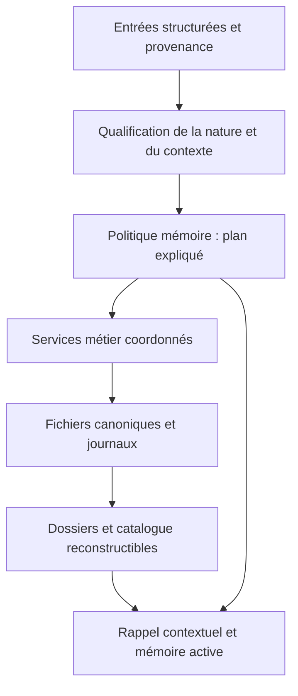

# Memory Engine — besoins, architecture et ordre des travaux

Date : 2026-09-30. Base de code examinée : `e0c21a9`, branche
`refactor/architecture-v1`. Ce document incorpore la clarification avec
toytoy et les propositions de Claude transmises dans la conversation.
Il distingue les besoins retenus des mécanismes proposés, non implémentés.
Le document complet de Claude n'était pas disponible pour cette revue.

## Mise à jour après reprise des travaux

Le bilan de code plus bas conserve sa base `e0c21a9`. Depuis : T-040 dispose
maintenant du [contrat fonctionnel 0.1](../schemas/memory-policy-v0.1.md),
de 14 scénarios attendus et de six tests du mapping Information/Memory,
dont 500 candidats synthétiques. Le router n'exécute pas encore ces scénarios.
T-039 est corrigé pour les journaux canoniques et couvert par deux tests de
reprise ; les autres contournements Thread restent sous T-031. Les deux
fonctions ont une preuve de test rouge après retrait du changement. Aucun
essai VM et aucune modification des estimations.

## But et périmètre

Fournir une mémoire durable, contextuelle, traçable et réutilisable par des
clients remplaçables. Pouvoir reprendre une discussion ou un projet, retrouver
les preuves et décisions, distinguer les situations présentes des observations
passées. Le stockage doit rester indépendant du modèle d'IA et de l'agent.

Les fichiers sont la source canonique ; les catalogues, index et récapitulatifs
calculés sont reconstructibles. Le moteur gère les objets, leurs relations,
leur cycle de vie et les règles de restitution. La perception du robot, son
contrôle de mouvement et l'exécution des actions appartiennent aux clients.
Définir leurs besoins n'autorise aucun travail sur Eidolon Core, Hermes ou
Qdrant dans cette séance. Aucun nouveau durcissement générique n'est demandé.

## Besoins retenus

### Validité contextuelle

Une affirmation doit être interprétable avec son sujet, ses conditions, son
lieu ou projet et sa période d'applicabilité. Deux conclusions peuvent être
validées pour des contextes différents et reliées pour expliquer leur écart.
Une contradiction apparente n'entraîne pas automatiquement `REFUTED`.
Un désaccord non résolu dans un même contexte reste visible ; le moteur ne
fabrique pas une résolution. Un contexte absent signifie inconnu, pas universel.

Exemple : préférer une limite GPU de 200 W pour le rendement et 300 W pour la
performance. La priorité de l'utilisateur permet de choisir la recommandation
applicable. La confiance, la preuve et l'applicabilité sont trois dimensions
distinctes. `VALIDATED` pour un Thread décrit son avancement, pas la vérité de
toutes les Informations qu'il référence.

### Origine, nature et autorité

Conserver séparément : source immédiate, auteur ou système d'origine, mode de
production (déclaration, mesure, observation, inférence), nature du contenu,
contexte, preuves, dates et horizon d'utilité. Les types métier existants
constituent une base ; les nouveaux champs et leur version restent à définir.

Le rôle administrateur détermine les droits et la portée des décisions, pas
la vérité de chaque phrase. Une discussion technique peut contenir hypothèse,
décision et résultat de test. Une discussion philosophique peut contenir une
opinion ou une question sans produire un fait général. Un message peut donc
produire plusieurs éléments, ou aucun élément durable.

Une observation interprétée par un modèle doit conserver la chaîne capteur →
interprétation → éventuelle validation. « Source robot » ne suffit pas à
qualifier sa fiabilité. Les valeurs inconnues ne sont pas inventées.

### Dossiers Markdown vivants

Une information relative à un projet ou une évolution future doit rechercher
le dossier approprié, le compléter ou en créer un si un nouveau sujet est
identifié. Le dossier contient objectif, récapitulatif, décisions contextualisées,
informations et sources, questions ouvertes, actions et échéances éventuelles.
Ne pas créer un dossier par phrase ni fusionner deux projets par simple mot-clé.
Un rattachement ambigu reste à examiner.

Proposition : utiliser le Thread comme support métier des projets/actions et
une vue Markdown avec références aux IDs et révisions sources. Séparer les
champs rédigés ou décidés par l'utilisateur du résumé recalculable, pour ne
pas écraser une décision lors d'une régénération. Un dossier de lieu peut
avoir besoin d'une autre vue que le cycle de statuts d'un projet : ce choix
reste ouvert. Toute synthèse périmée doit être signalée ou reconstruite.

### Trois niveaux de disponibilité

| Niveau | Usage | Contenu attendu |
| --- | --- | --- |
| Haute | Discussion, perception ou tâche active | Sélection limitée et actuelle, avec contexte et sources |
| Intermédiaire | Reprise probable, en attente ou programmée | Fiches, mots-clés, dossiers actifs, actions, échéances et références |
| Basse | Conservation longue durée | Informations complètes, anciens dossiers, preuves et historique conservé |

Ces niveaux ne sont ni des degrés de vérité, ni nécessairement trois copies
ou répertoires. Une connaissance durable peut être chargée en mémoire haute.
Un catalogue léger doit également rendre les éléments bas retrouvables :
identité, résumé, mots-clés, contexte, révision et emplacement, selon les droits.
Son périmètre d'indexation doit être explicite et il doit suivre corrections
et suppressions ; il ne doit pas devenir une copie oubliée de données effacées.

Éviction du contexte actif, fin d'applicabilité, archivage et suppression sont
des opérations différentes. Les échéances doivent préparer une réactivation
persistante et rejouable ; le composant qui déclenche effectivement les tâches
reste à définir. Aucun planificateur n'est livré par cette décision.

### Scénarios qui fixent le sens des politiques

| Entrée | Interprétation | Résultat attendu, à tester |
| --- | --- | --- |
| Discussion technique avec l'admin | Distinguer décision, hypothèse, contrainte et preuve | Rattacher au projet et conserver les conditions ; aucune confirmation fondée sur le seul rôle |
| Réflexion philosophique avec l'admin | Opinion, exploration, question ou préférence selon le propos | Conserver le contexte si utile ; aucune promotion automatique en fait général |
| Deux chambres, un bureau, une salle de bain et un WC au bout du couloir | Connaissance spatiale candidate, liée à un lieu | Dossier du lieu et conservation durable après qualification ; révision possible et rappel rapide pendant navigation |
| Un chat vient de passer | Observation datée d'un objet mobile | Disponibilité immédiate ; ne pas présenter sa dernière position comme actuelle indéfiniment ; conservation selon utilité |
| Fourchette au sol, contournée | Observation d'obstacle et action distinctes | Le contournement ne supprime pas l'obstacle ; présence à revérifier, puis état mis à jour si déplacement constaté |
| Projet à reprendre à une date future | Intention et déclencheur explicites | Dossier persistant, fiche intermédiaire, réactivation sans doublon et traitement du redémarrage |
| Conclusions différentes selon le contexte | Recommandations conditionnelles | Retourner celle applicable et expliquer l'autre, ou signaler le contexte manquant |

Une observation passée peut rester exacte sans décrire l'état présent.
La répétition d'observations peut contribuer à une connaissance plus stable,
mais les observations et la conclusion doivent rester reliées et distinguées.
Aucun TTL arbitraire ni suppression automatique n'est décidé ici.

## Bilan de l'architecture existante

| Bloc | Présent et vérifié dans le code | Écart avec les besoins |
| --- | --- | --- |
| Modèle Information | `core/information/models.py`, schémas : types, statuts, contexte, provenance, temps, rétention | Conditions d'applicabilité et règles par nature peu structurées ; pas de qualification sémantique automatique |
| Contrat de stockage | `core/backend/models.py` : `Memory`, métadonnées, provenance, temporalité, vérification | Coexiste avec le modèle `Information` ; correspondance métier à rendre explicite et testée avant extension |
| Classifier historique | Règles par type et relations ; catégories WORKING/EPISODIC/SEMANTIC/ASSOCIATIVE/PROCEDURAL/PROSPECTIVE | Ne comprend pas les nuances des exemples ; PROSPECTIVE toujours NO, SEMANTIC toujours POSSIBLE |
| Router historique | Produit un plan et transporte contexte/provenance/rétention | Nouvelle entrée → STORE ; IGNORE faux ; ces champs ne pilotent pas la conservation ; interface front matter historique |
| Persistance | Fichiers versionnés, verrous, révisions, publication atomique | Atomicité par fichier, pas de transaction de lecture multi-fichiers |
| Écritures Information | `store/update` protégés par verrou ; suppression avec reçu récupérable | Pas d'Operation/Event coordonné pour création et mise à jour |
| Threads | Markdown, actions, relations, services de création/statut/suppression journalisés | `create/update` directs hors journal ; défaut T-039 ; pas de dossier récapitulatif actualisé automatiquement |
| Recherche et contexte | `lexical_v1`, extraits bornés, étiquettes, filtres explicites | Pas de politique complète d'applicabilité ni trois niveaux actifs ; scores lexicaux sans preuve de vérité |
| Cycle de vie | Audits en lecture seule, suppressions contrôlées | Pas de politique exécutable par nature, de consolidation autonome ou de réactivation programmée |
| Index, migration, exploitation | Port sans dépendance externe, convertisseur, archives, vérificateur, recette VM, preflight | Index non synchronisé ; qualité réelle et recette VM non validées |

Preuve locale du 30/09 : trois `OBSERVATION` couloir/chat/fourchette, avec
respectivement LONG_TERM/DISPOSABLE/TEMPORARY, donnent toutes EPISODIC,
STORE=true, INDEX=true et IGNORE=false via classifier puis router. Vérification
en mémoire, sans données réelles. Ce n'est pas encore un test versionné.

Dernière exécution avant cette modification documentaire : pytest 9.1.1,
**666 réussis, 5 désélectionnés en 29,33 s** sur le contenu `e0c21a9`.
Les cinq cas de concurrence restent non validés, de même que la VM et la
durabilité du disque réel. Cette séance n'ajoute aucune preuve fonctionnelle.

## Architecture cible proposée

Ce diagramme est une cible, pas un flux déjà raccordé. La qualification peut
recevoir des annotations humaines, capteurs ou propositions de modèle ; le
moteur ne doit pas dépendre obligatoirement d'un LLM pour appliquer ses règles.
Une proposition incertaine conserve son origine et ne devient pas une preuve.

La politique décide séparément persistance, rattachement, disponibilité,
applicabilité, réexamen et réactivation. Une décision de conservation ne vaut
pas autorisation de suppression. Le plan expose raisons et version des règles.
Le moteur applique les mutations par le service, puis actualise les vues
dérivées de façon reprise/reconstructible. Les lecteurs doivent savoir si une
vue est périmée ou une opération inachevée, sans promesse d'instantané global.

Le service Information et la rétention des snapshots sont détaillés dans
[DESIGN-INFORMATION-WRITES.md](DESIGN-INFORMATION-WRITES.md). Le catalogue
n'impose aucun connecteur externe. Une interface moteur testable avec des
clients factices suffit à ce stade.

## Priorités et critères d'achèvement

Ordre de développement : P0 → P1 → P2 → P3 → P4 → P5. La recette VM est
une voie distincte, réalisable dès que la copie est disponible ; elle reste
un verrou avant toute mise en service et devra couvrir les futures modifications.

| Priorité | Travaux | Résultat exigé avant passage au bloc suivant |
| --- | --- | --- |
| P0 — Contrat fonctionnel | T-040 : qualifier source/nature/contexte/applicabilité ; fixer les frontières des trois niveaux et de l'oubli ; formaliser les scénarios ci-dessus | Contrat versionné et table d'attendus, distinguant décidé et inconnu ; mapping Information ↔ Memory et import défini |
| P1 — Écritures coordonnées | T-031/T-039/T-041/T-042 : chemin métier canonique Information/Thread ; traiter T-039 dans ce lot ; import distinct ; conflit avec suppression ; contrat de compaction | Tests d'interruption/rejeu et de conflit, dont retrait de fonctionnalité faisant échouer le test ; transition reçus/snapshots récupérable ; aucun ancien appelant supposé migré sans inventaire |
| P2 — Router métier | T-043 : qualification explicite et politique déterministe, d'abord en simulation | Les exemples produisent des plans différents et expliqués ; rôle admin distinct de vérité ; absence de contexte et désaccord couverts |
| P3 — Dossiers et catalogue | T-044/T-045 : créer/rattacher/actualiser le dossier .md, préserver décisions et sources ; catalogue reconstructible | Reprise de projet, correction propagée, ambiguïté visible, recherche d'éléments bas ; aucune duplication canonique silencieuse |
| P4 — Disponibilité et cycle de vie | T-046 : activation/désactivation, fraîcheur, réexamen et échéances persistantes ; oubli autorisé | Tests à horloge contrôlée et après redémarrage ; position passée non présentée actuelle ; obstacle contourné conservé comme potentiellement présent ; contenu retiré des vues concernées |
| P5 — Parcours et qualité | T-047/T-036 : rappel contextualisé, explication des sources, budgets, scénarios complets et mesures sur corpus représentatif | Reprise de projet depuis un client factice, distinction des contextes et des sources, pertinence et latence mesurées ; limites explicites |
| VM — Condition de mise en service | T-010 à T-015/T-021/T-032 : copie arrêtée, écrivains, sauvegarde/restauration par hash, concurrence, audits et migration | Rapport de recette réelle sur le commit candidat ; aucun résultat local substitué à cette preuve |

Chaque bloc doit rester petit, avec preuve adaptée, avant d'étendre le périmètre.
Les nouveaux travaux concernent l'architecture métier, pas une nouvelle série
de micro-durcissements. T-039 était seulement documenté au cadrage initial ;
son traitement local est indiqué dans la mise à jour en tête de document.
Les intégrations externes et le tableau de bord restent différés.

## Décisions encore ouvertes

- Granularité exacte du contexte et règles de comparaison des conditions.
- Autorité de qualification/consolidation et seuils nécessitant une revue.
- Forme du dossier de lieu et mode de résumé (déterministe ou proposition d'un modèle).
- Délais par nature et déclencheurs de réexamen ; aucun délai universel choisi.
- Responsabilité du déclenchement planifié et budget de mémoire active côté client.
- Conditions de compaction, résultat minimal de rejeu, politique des sauvegardes
  et traitement des opérations bloquées avant suppression de leurs snapshots.

La grille pondérée reste **50,75 points** et l'estimation globale **45 %**.
Documenter une cible n'implémente aucun bloc ; aucune progression chiffrée
n'est créditée pour cette mise à jour.
